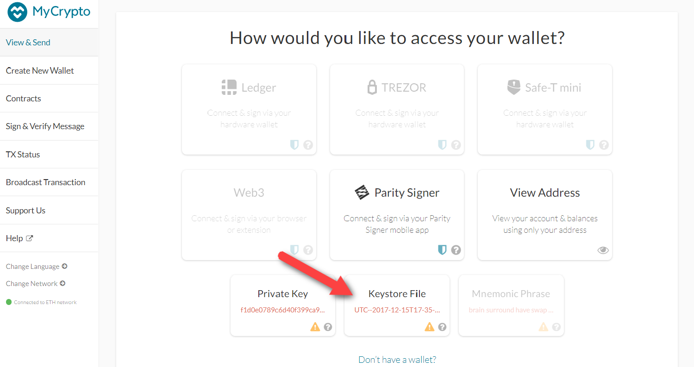
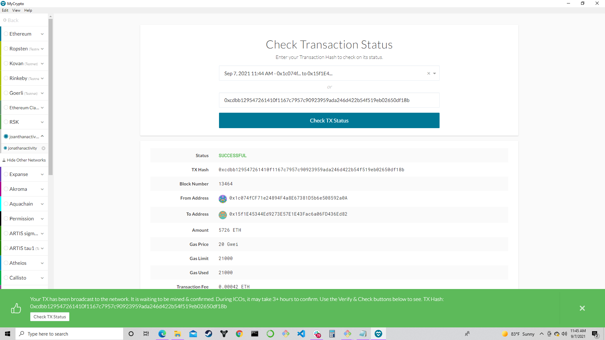

# Running a Proof of Authority Blockchain

The Proof of Authority (PoA) algorithm is typically used for private blockchain networks as it requires pre-approval of, or voting in of, the account addresses that can approve transactions (seal blocks).  

1. Because the accounts must be approved, we will generate two new nodes with new account addresses that will serve as our pre-approved sealer addresses.

    * Create accounts for two nodes for the network with a separate `datadir` for each using `geth`.
        * ./geth --datadir node1 account new
        * ./geth --datadir node2 account new

2. Next, generate your genesis block.

    * Run `puppeth`, name your network, and select the option to configure a new genesis block.

    * Choose the `Clique (Proof of Authority)` consensus algorithm.

    * Paste both account addresses from the first step one at a time into the list of accounts to seal.

    * Paste them again in the list of accounts to pre-fund. There are no block rewards in PoA, so you'll need to pre-fund.

    * You can choose `no` for pre-funding the pre-compiled accounts (0x1 .. 0xff) with wei. This keeps the genesis cleaner.

    * Complete the rest of the prompts, and when you are back at the main menu, choose the "Manage existing genesis" option.

    * Export genesis configurations. This will fail to create two of the files, but you only need `networkname.json`.

3. With the genesis block creation completed, we will now initialize the nodes with the genesis' json file.

    * Using `geth`, initialize each node with the new `networkname.json`.
        * ./geth --datadir node1 init networkname.json (in my case "jonathanactivity.json")
        * ./geth --datadir node2 init networkname.json

4. Now the nodes can be used to begin mining blocks.

    * Run the nodes in separate terminal windows with the commands:
        *  ./geth --datadir node1 --unlock "SEALER_ONE_ADDRESS" --mine --rpc --allow-insecure-unlock
        *  ./geth --datadir node2 --unlock "SEALER_TWO_ADDRESS" --mine --port 30304 --bootnodes "enode://SEALER_ONE_ENODE_ADDRESS@127.0.0.1:30303" --ipcdisable --allow-insecure-unlock
    * **NOTE:** Type your password and hit enter - even if you can't see it visually!

5. Your private PoA blockchain should now be running!

6. With both nodes up and running, the blockchain can be added to MyCrypto for testing.

    * Open the MyCrypto app, then click `Change Network` at the bottom left:

    

    * Click "Add Custom Node", then add the custom network information that you set in the genesis.

    * Make sure that you scroll down to choose `Custom` in the "Network" column to reveal more options like `Chain ID`:

    

    * Type `ETH` in the Currency box.
    
    * In the Chain ID box, type the chain id you generated during genesis creation.

    * In the URL box type: `http://127.0.0.1:8545`.  This points to the default RPC port on your local machine.

    * Finally, click `Save & Use Custom Node`. 

7. After connecting to the custom network in MyCrypto, it can be tested by sending money between accounts.

    * Select the `View & Send` option from the left menu pane, then click `Keystore file`.

    

    * On the next screen, click `Select Wallet File`, then navigate to the keystore directory inside your Node1 directory, select the file located there, provide your password when prompted and then click `Unlock`.

    * This will open your account wallet inside MyCrypto. 
    
    * Looks like we're filthy rich! This is the balance that was pre-funded for this account in the genesis configuration; however, these millions of ETH tokens are just for testing purposes.   

    

    * In the `To Address` box, type the account address from Node2, then fill in an arbitrary amount of ETH:

     

    * Confirm the transaction by clicking "Send Transaction", and the "Send" button in the pop-up window.  

    

    * Click the `Check TX Status` when the green message pops up, confirm the logout:

    

    * You should see the transaction go from `Pending` to `Successful` in around the same blocktime you set in the genesis.

    * You can click the `Check TX Status` button to update the status.

    

Congratulations, you successfully created your own private blockchain!
